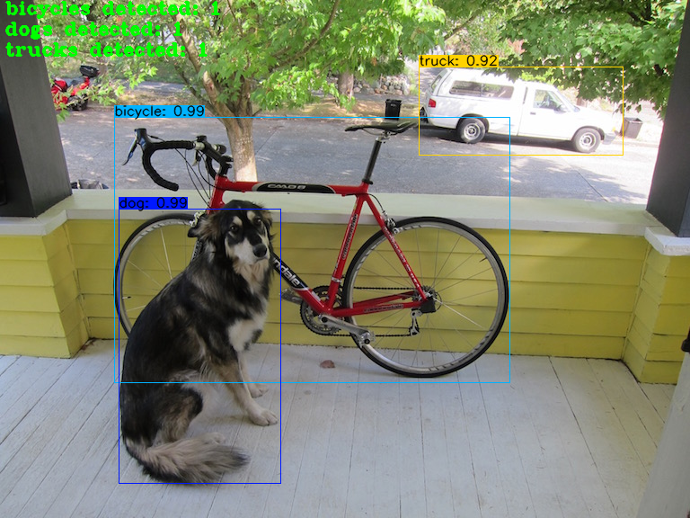

# ObjectLivecount
Object count with yolov4 and tensorflow mmodel
<p align="center"></p>

## Getting Started
### Conda (Recommended)

```bash
# Tensorflow CPU
conda env create -f conda-cpu.yml
conda activate yolov4-cpu

# Tensorflow GPU
conda env create -f conda-gpu.yml
conda activate yolov4-gpu
```

### Pip
```bash
# TensorFlow CPU
pip install -r requirements.txt

# TensorFlow GPU
pip install -r requirements-gpu.txt
```
### Nvidia Driver (For GPU, if you are not using Conda Environment and haven't set up CUDA yet)
Make sure to use CUDA Toolkit version 10.1 as it is the proper version for the TensorFlow version used in this repository.
https://developer.nvidia.com/cuda-10.1-download-archive-update2

## Downloading Official Pre-trained Weights
YOLOv4 comes pre-trained and able to detect 80 classes. For easy demo purposes we will use the pre-trained weights.
Download pre-trained yolov4.weights file: https://drive.google.com/open?id=1cewMfusmPjYWbrnuJRuKhPMwRe_b9PaT

Copy and paste yolov4.weights from your downloads folder into the 'data' folder of this repository.

If you want to use yolov4-tiny.weights, a smaller model that is faster at running detections but less accurate, download file here: https://github.com/AlexeyAB/darknet/releases/download/darknet_yolo_v4_pre/yolov4-tiny.weights

## Using Custom Trained YOLOv4 Weights
<strong>Learn How To Train Custom YOLOv4 Weights here: https://www.youtube.com/watch?v=mmj3nxGT2YQ </strong>

<strong>Watch me Walk-Through using Custom Model in TensorFlow :https://www.youtube.com/watch?v=nOIVxi5yurE </strong>

USE MY LICENSE PLATE TRAINED CUSTOM WEIGHTS: https://drive.google.com/file/d/1EUPtbtdF0bjRtNjGv436vDY28EN5DXDH/view?usp=sharing

Copy and paste your custom .weights file into the 'data' folder and copy and paste your custom .names into the 'data/classes/' folder.


<strong>Note:</strong> If you are using the pre-trained yolov4 then make sure that line 14 remains <strong>coco.names</strong>.

## YOLOv4 Using Tensorflow (tf, .pb model)
To implement YOLOv4 using TensorFlow, first we convert the .weights into the corresponding TensorFlow model files and then run the model.
```bash
# Convert darknet weights to tensorflow
## yolov4
python save_model.py --weights ./data/yolov4.weights --output ./checkpoints/yolov4-416 --input_size 416 --model yolov4 

# Run yolov4 tensorflow model
python detect.py --weights ./checkpoints/yolov4-416 --size 416 --model yolov4 --images ./data/images/kite.jpg

# Run yolov4 on video
python detect_video.py --weights ./checkpoints/yolov4-416 --size 416 --model yolov4 --video ./data/video/video.mp4 --output ./detections/results.avi

# Run yolov4 on webcam
python detect_video.py --weights ./checkpoints/yolov4-416 --size 416 --model yolov4 --video 0 --output ./detections/results.avi
```


## YOLOv4-Tiny using TensorFlow
The following commands will allow you to run yolov4-tiny model.
```
# yolov4-tiny
python save_model.py --weights ./data/yolov4-tiny.weights --output ./checkpoints/yolov4-tiny-416 --input_size 416 --model yolov4 --tiny

# Run yolov4-tiny tensorflow model
python detect.py --weights ./checkpoints/yolov4-tiny-416 --size 416 --model yolov4 --images ./data/images/kite.jpg --tiny
```

## Custom YOLOv4 Using TensorFlow
The following commands will allow you to run your custom yolov4 model. (video and webcam commands work as well)
```
# custom yolov4
python save_model.py --weights ./data/custom.weights --output ./checkpoints/custom-416 --input_size 416 --model yolov4 

# Run custom yolov4 tensorflow model
python detect.py --weights ./checkpoints/custom-416 --size 416 --model yolov4 --images ./data/images/car.jpg
```


## Custom Functions and Flags
Here is how to use all the currently supported custom functions and flags that I have created.

<a name="counting"/>

<p align="center"></p>

#### Count Total Objects
To count total objects all that is needed is to add the custom flag "--count" to your detect.py or detect_video.py command.
```
# Run yolov4 model while counting total objects detected
python detect.py --weights ./checkpoints/yolov4-416 --size 416 --model yolov4 --images ./data/images/dog.jpg --count
```

#### Count Objects Per Class
To count the number of objects for each individual class of your object detector you need to add the custom flag "--count" as well as change one line in the detect.py or detect_video.py script. By default the count_objects function has a parameter called <strong>by_class</strong> that is set to False. If you change this parameter to <strong>True</strong> it will count per class instead.


Then run the same command as above:
```
# Run yolov4 model while counting objects per class
python detect.py --weights ./checkpoints/yolov4-416 --size 416 --model yolov4 --images ./data/images/dog.jpg --count
```

<a name="info"/>

### Print Detailed Info About Each Detection (class, confidence, bounding box coordinates)
I have created a custom flag called <strong>INFO</strong> that can be added to any detect.py or detect_video.py commands in order to print detailed information about each detection made by the object detector. To print the detailed information to your command prompt just add the flag "--info" to any of your commands. The information on each detection includes the class, confidence in the detection and the bounding box coordinates of the detection in xmin, ymin, xmax, ymax format.


Example of info field added to command:
```
python detect.py --weights ./checkpoints/yolov4-416 --size 416 --model yolov4 --images ./data/images/dog.jpg --info
```


<strong>Note:</strong> You can add the --info flag to detect_video.py commands as well!

## YOLOv4 Using TensorFlow Lite (.tflite model)
Can also implement YOLOv4 using TensorFlow Lite. TensorFlow Lite is a much smaller model and perfect for mobile or edge devices (raspberry pi, etc).
```bash
# Save tf model for tflite converting
python save_model.py --weights ./data/yolov4.weights --output ./checkpoints/yolov4-416 --input_size 416 --model yolov4 --framework tflite

# yolov4
python convert_tflite.py --weights ./checkpoints/yolov4-416 --output ./checkpoints/yolov4-416.tflite

# yolov4 quantize float16
python convert_tflite.py --weights ./checkpoints/yolov4-416 --output ./checkpoints/yolov4-416-fp16.tflite --quantize_mode float16

# yolov4 quantize int8
python convert_tflite.py --weights ./checkpoints/yolov4-416 --output ./checkpoints/yolov4-416-int8.tflite --quantize_mode int8 --dataset ./coco_dataset/coco/val207.txt

# Run tflite model
python detect.py --weights ./checkpoints/yolov4-416.tflite --size 416 --model yolov4 --images ./data/images/kite.jpg --framework tflite
```
### Result Image (TensorFlow Lite)
You can find the outputted image(s) showing the detections saved within the 'detections' folder.


Yolov4 and Yolov4-tiny int8 quantization have some issues. I will try to fix that. You can try Yolov3 and Yolov3-tiny int8 quantization 


# yolov4
python save_model.py --weights ./data/yolov4.weights --output ./checkpoints/yolov4.tf --input_size 416 --model yolov4
python convert_trt.py --weights ./checkpoints/yolov4.tf --quantize_mode float16 --output ./checkpoints/yolov4-trt-fp16-416
python detect.py --weights ./checkpoints/yolov4-trt-fp16-416 --model yolov4 --images ./data/images/kite.jpg --framework trt
```

## Command Line Args Reference

```bash
save_model.py:
  --weights: path to weights file
    (default: './data/yolov4.weights')
  --output: path to output
    (default: './checkpoints/yolov4-416')
  --[no]tiny: yolov4 or yolov4-tiny
    (default: 'False')
  --input_size: define input size of export model
    (default: 416)
  --framework: what framework to use (tf, trt, tflite)
    (default: tf)
  --model: yolov3 or yolov4
    (default: yolov4)

detect.py:
  --images: path to input images as a string with images separated by ","
    (default: './data/images/kite.jpg')
  --output: path to output folder
    (default: './detections/')
  --[no]tiny: yolov4 or yolov4-tiny
    (default: 'False')
  --weights: path to weights file
    (default: './checkpoints/yolov4-416')
  --framework: what framework to use (tf, trt, tflite)
    (default: tf)
  --model: yolov3 or yolov4
    (default: yolov4)
  --size: resize images to
    (default: 416)
  --iou: iou threshold
    (default: 0.45)
  --score: confidence threshold
    (default: 0.25)
  --count: count objects within images
    (default: False)
  --dont_show: dont show image output
    (default: False)
  --info: print info on detections
    (default: False)
    
detect_video.py:
  --video: path to input video (use 0 for webcam)
    (default: './data/video/video.mp4')
  --output: path to output video (remember to set right codec for given format. e.g. XVID for .avi)
    (default: None)
  --output_format: codec used in VideoWriter when saving video to file
    (default: 'XVID)
  --[no]tiny: yolov4 or yolov4-tiny
    (default: 'false')
  --weights: path to weights file
    (default: './checkpoints/yolov4-416')
  --framework: what framework to use (tf, trt, tflite)
    (default: tf)
  --model: yolov3 or yolov4
    (default: yolov4)
  --size: resize images to
    (default: 416)
  --iou: iou threshold
    (default: 0.45)
  --score: confidence threshold
    (default: 0.25)
  --count: count objects within video
    (default: False)
  --dont_show: dont show video output
    (default: False)
  --info: print info on detections
    (default: False)
```

### References  

   Huge shoutout goes to hunglc007 for creating the backbone of this repository:
  * [tensorflow-yolov4-tflite](https://github.com/hunglc007/tensorflow-yolov4-tflite)
